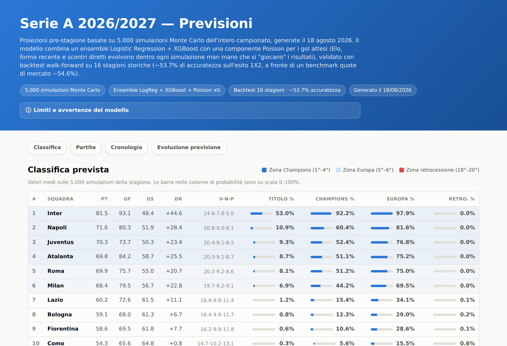
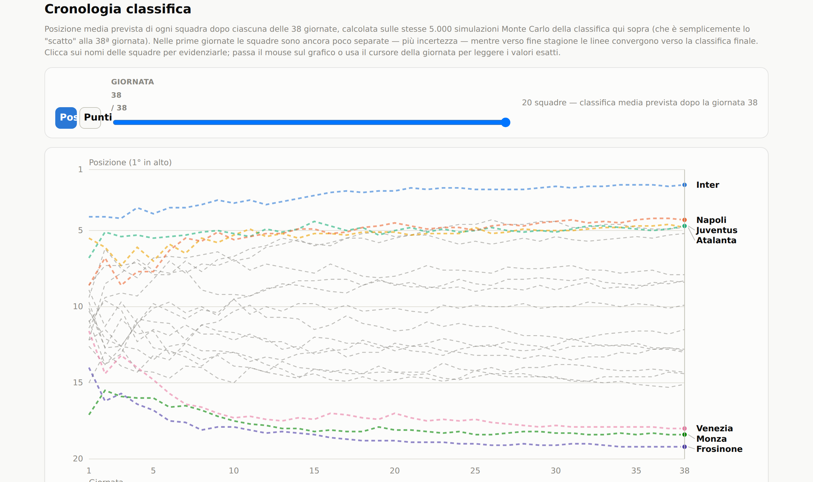

# ⚽ Serie A Predictor

**Simulazione Monte Carlo del campionato di Serie A 2026/2027**, con classifica aggiornata man mano che le partite vengono giocate.


-brightgreen)

Il progetto allena un ensemble di modelli statistici sullo storico di Serie A (2005/06 → 2025/26, 26 stagioni), poi simula l'intera stagione 2026/2027 **5.000 volte** per stimare probabilità 1X2 partita per partita e la classifica finale attesa — titolo, Champions, Europa, retrocessione comprese. Appena il campionato inizia, lo script rileva automaticamente le partite già giocate e le usa come punto di partenza reale, simulando solo le giornate rimanenti.

<p align="center">
  
</p>

<details>
<summary><strong>📈 La dashboard include anche l'evoluzione della classifica giornata per giornata</strong></summary>
<br>
<p align="center">
  
</p>
</details>

---

## Indice

- [Cosa fa](#cosa-fa)
- [Come funziona](#come-funziona)
- [Quanto è affidabile](#quanto-è-affidabile)
- [Struttura del progetto](#struttura-del-progetto)
- [Avvio rapido](#avvio-rapido)
- [Dashboard](#dashboard)
- [Aggiornamento durante la stagione](#aggiornamento-durante-la-stagione)
- [Limiti dichiarati](#limiti-dichiarati)
- [Stato del progetto](#stato-del-progetto)
- [Fonti dati e crediti](#fonti-dati-e-crediti)
- [Licenza](#licenza)

---

## Cosa fa

- **Previsioni 1X2** per tutte le 380 partite della stagione, con probabilità di vittoria casa/pareggio/vittoria trasferta.
- **Classifica finale prevista**, con probabilità di vincere il titolo, qualificarsi in Champions League (top 4), andare in Europa (top 6) o retrocedere, per ognuna delle 20 squadre.
- **Classifica ibrida reale/simulata**: appena il campionato inizia, le partite già giocate diventano il punto di partenza esatto (non simulato) — la simulazione copre solo le giornate ancora da giocare.
- **Cronologia** di come la classifica prevista si sviluppa giornata per giornata, e **archivio di come cambia la previsione nel tempo** man mano che nuovi risultati reali vengono integrati durante la stagione.
- **Dashboard HTML autonoma**, un unico file navigabile in qualunque browser, senza server né connessione a internet.

## Come funziona

Ogni previsione nasce dalla combinazione di più segnali, ciascuno costruito e validato in una fase distinta del progetto (vedi i report `FASE*_REPORT.md`):

| Segnale | Cosa cattura |
|---|---|
| **Elo dinamico** | forza della squadra, aggiornato partita per partita (proprio motore Elo: K=20, vantaggio-casa 100 punti) |
| **Forma recente** | punti nelle ultime 3/5 partite |
| **Scontri diretti (H2H)** | punti-a-partita negli ultimi 5 precedenti tra le due squadre |
| **Modello Poisson/Dixon-Coles** | gol attesi casa/trasferta, da rating di attacco/difesa per squadra (rifittato ogni stagione su una finestra mobile delle ultime 5) |
| **Valore rosa (Transfermarkt)** | valore di mercato attuale della rosa, snapshot e storico per stagione |
| **Contesto** | giorni di riposo, avanzamento in stagione, vantaggio-casa "di periodo" (in calo strutturale negli ultimi 20 anni) |

Queste feature alimentano un **ensemble** di due modelli allenati con validazione **walk-forward** (mai split casuale: si allena solo sul passato, si valuta sul futuro, esattamente come si farebbe in produzione):

- **Logistic Regression** — modello lineare, competitivo con dataset di questa dimensione.
- **XGBoost** — cattura interazioni non lineari, con calibrazione delle probabilità (sigmoid/Platt scaling).

Le stagioni più recenti pesano di più nel training (decadimento esponenziale, half-life di 10 stagioni), così il modello si adatta senza dimenticare lo storico più lontano.

**Simulazione Monte Carlo anziché previsione diretta.** Lo stato delle squadre (Elo, forma, scontri diretti) cambia partita dopo partita in base a risultati non ancora noti al momento della previsione. La stagione viene quindi **giocata virtualmente 5.000 volte**: ad ogni simulazione si gioca ogni giornata in ordine cronologico, si estraggono le probabilità 1X2 dall'ensemble con lo stato aggiornato *di quella specifica simulazione*, si estrae un esito casuale, si aggiorna lo stato, si passa alla giornata successiva. Mediando le 5.000 traiettorie si ottengono probabilità più realistiche rispetto a una previsione "statica" fatta con lo stato di oggi proiettato su tutta la stagione.

## Quanto è affidabile

Tutti i modelli sono validati con backtest walk-forward su **16 stagioni storiche** (2010/11 → 2025/26), confrontati con le quote di mercato dei bookmaker come benchmark esterno:

| Modello | Accuracy | Log-loss |
|---|---|---|
| Quote di mercato (benchmark) | 54,6% | 0,961 |
| Baseline "vince sempre la casa" | 43,6% | 1,737 |
| Logistic Regression | 53,8% | 0,977 |
| XGBoost | 53,6% | 0,977 |
| **Ensemble (peso 0,5/0,5, half-life 10 stagioni)** | **53,9%** | **0,968** |

L'ensemble è il modello di riferimento del progetto: non supera le quote di mercato (che incorporano informazioni non disponibili qui, come notizie su formazioni e infortuni), ma si avvicina con sole ~19 feature interpretabili, ed è al di sopra della baseline "vince sempre la casa". Ogni scelta di iperparametro (peso dell'ensemble, moltiplicatore del valore rosa, half-life della ponderazione stagionale) è stata validata senza osservare l'holdout finale durante la selezione del parametro.

<details>
<summary><strong>Vedi l'evoluzione dei modelli fase per fase</strong></summary>

| Fase | Novità | Effetto |
|---|---|---|
| 1 | Raccolta dati, pulizia, classifica storica | 9.012 partite Serie A 2000/01-2024/25, verificate contro dati ufficiali |
| 2 | Feature engineering + Logistic Regression | 54,0% accuracy, già vicino alle quote di mercato |
| 3 | Modello Poisson + XGBoost + calibrazione | XGBoost non supera la Logistic Regression da solo in questa fase |
| 4 | Ensemble + pipeline di aggiornamento | Il log-loss dell'ensemble supera entrambi i modelli singoli |
| 4b | Integrazione stagione 2025/26 | Backtest esteso a 16 stagioni, mai viste durante lo sviluppo |
| 4c | Valore rosa (Transfermarkt) | XGBoost supera per la prima volta la Logistic Regression sull'holdout |
| 4d | Più peso al valore rosa | Miglioramento marginale ma reale; peso ensemble ribilanciato a 0,5/0,5 |
| 4e | Ponderazione stagioni recenti | Miglior log-loss ottenuto finora (0,9675 sull'holdout) |
| 5 | Simulazione Monte Carlo stagione 2026/27 | Da backtest storico a previsioni vere e proprie |
| 6 | Classifica ibrida reale/simulata + aggiornamento live | Il modello "impara" dai risultati reali mano a mano che vengono giocati |

</details>

## Struttura del progetto

```
serieA_predictor/
├── src/
│   ├── common/          # moduli condivisi: motore Elo, classifica, modello Poisson
│   ├── preprocessing/   # pulizia dati e feature engineering
│   ├── training/        # addestramento dei modelli (LogReg, XGBoost, ensemble)
│   ├── simulation/       # simulazione Monte Carlo della stagione
│   └── live_update/      # integrazione dei risultati reali durante la stagione
├── data/
│   ├── raw/              # dati grezzi (storico partite, calendario, valore rose)
│   ├── processed/        # dati puliti, feature, previsioni, classifiche
│   └── incoming/         # cartella "buca delle lettere" per l'aggiornamento settimanale
├── models/                # modelli addestrati (.pkl, non versionati)
├── dashboard/             # generatore della dashboard HTML autonoma
├── notebooks/             # script di analisi esplorativa e grafici di backtest
└── requirements.txt
```

Ogni sottocartella di `src/` corrisponde a una fase della pipeline — vedi [`GUIDA_ESECUZIONE_LOCALE.md`](GUIDA_ESECUZIONE_LOCALE.md) per l'elenco completo dei comandi nell'ordine in cui vanno eseguiti, e i file `FASE*_REPORT.md` per il dettaglio di ogni fase di sviluppo.

## Avvio rapido

```bash
git clone <url-del-repository>
cd serieA_predictor
python3 -m venv .venv
source .venv/bin/activate          # Windows: .venv\Scripts\Activate.ps1
pip install -r requirements.txt

python src/preprocessing/prepare_data.py
python src/preprocessing/feature_builder.py
python src/preprocessing/build_poisson_features.py
python src/preprocessing/merge_squad_value_feature.py
python src/training/train_baseline.py
python src/training/train_xgboost.py
python src/simulation/predict_season.py
python dashboard/build_dashboard.py
```

Il file `dashboard/previsioni_2026_27.html` generato dall'ultimo comando è pronto per essere aperto nel browser. La guida completa — inclusi i passaggi opzionali (valore rosa da zero), i tempi di esecuzione di ciascuno script e le istruzioni dettagliate per Windows — è in [`GUIDA_ESECUZIONE_LOCALE.md`](GUIDA_ESECUZIONE_LOCALE.md).

## Dashboard

Un unico file HTML autonomo (nessuna chiamata di rete, nessuna dipendenza esterna), con quattro sezioni:

- **Classifica** — posizione, punti, gol, probabilità titolo/Champions/Europa/retrocessione per ogni squadra.
- **Partite** — probabilità 1X2 per tutte le 380 partite, filtrabili per squadra e giornata.
- **Cronologia** — come si sviluppa la classifica prevista giornata per giornata (linea piena per le giornate già giocate, tratteggio per la proiezione).
- **Evoluzione previsione** — come cambia la previsione stessa nel corso della stagione, mano a mano che si integrano nuovi risultati reali, con un selettore per vedere il piazzamento reale o la posizione media grezza delle simulazioni.

## Aggiornamento durante la stagione

Una volta iniziato il campionato, `src/simulation/predict_season.py` rileva automaticamente le partite 2026/2027 già giocate nello storico: le usa come classifica reale di partenza (Elo, forma e scontri diretti ripartono dallo stato post-ultima-partita reale) e simula solo le giornate rimanenti — nessun parametro da passare.

Ritmo consigliato (dettagli e comandi completi in [`GUIDA_ESECUZIONE_LOCALE.md`](GUIDA_ESECUZIONE_LOCALE.md#9-durante-la-stagione-integrare-risultati-reali-e-cadenza-consigliata-fase-6)):

| Cadenza | Cosa | Perché |
|---|---|---|
| Ogni settimana | Integra i risultati reali, ricalcola classifica/previsioni/dashboard | Elo e forma sono aritmetica pura, nessun retraining necessario |
| Ogni 3-5 giornate | Come sopra + retraining dei modelli | I modelli traggono beneficio da retraining solo quando ci sono abbastanza partite nuove da "contare" nell'apprendimento |

## Limiti dichiarati

- **Neopromosse** (Frosinone, Monza, Venezia): l'ultimo dato Elo/forma disponibile risale alla loro ultima apparizione in Serie A, non alla stagione di Serie B appena vinta (dati non disponibili) — rating di partenza meno aggiornato per queste 3 squadre.
- **Valore rosa**: snapshot statico, non aggiornato in tempo reale — non cattura gli ultimi ~2 mesi di calciomercato prima dell'inizio del campionato. Frosinone e Monza restano inoltre sotto la soglia minima di copertura Transfermarkt (dato marcato come meno affidabile, non eliminato).
- **Spareggio in classifica**: differenza reti poi gol fatti, senza il criterio degli scontri diretti (che in Serie A ha priorità) — impatto trascurabile su medie aggregate su 5.000 simulazioni.
- **Modello statico durante la stagione**: Elo/forma/H2H si aggiornano da soli partita per partita, ma il modello di machine learning vero e proprio va ri-addestrato manualmente ogni tanto per incorporare i risultati recenti anche nell'apprendimento, non solo nella simulazione.

## Stato del progetto

Fasi 1-6 completate (raccolta dati → simulazione → aggiornamento live durante la stagione). Il campionato 2026/2027 non è ancora iniziato: le previsioni attuali sono pre-stagione, aggiornate automaticamente appena vengono giocate le prime partite. Dettaglio di ogni fase nei rispettivi `FASE*_REPORT.md`.

## Fonti dati e crediti

- Storico partite 2000/01-2024/25: [Football-Data.co.uk](https://www.football-data.co.uk/), via il mirror GitHub [`xgabora/Club-Football-Match-Data-2000-2025`](https://github.com/xgabora/Club-Football-Match-Data-2000-2025).
- Stagione 2025/26 e aggiornamenti stagione corrente: [Football-Data.co.uk](https://www.football-data.co.uk/) (download manuale, formato Italy → Serie A).
- Valore di mercato rose: dataset Kaggle [`davidcariboo/player-scores`](https://www.kaggle.com/datasets/davidcariboo/player-scores) (dati Transfermarkt).
- Calendario 2026/2027: worldfootball.net.

## Licenza

Nessuna licenza formale ancora assegnata a questo repository — il codice è pensato per uso personale/didattico. I dataset di terze parti elencati sopra restano soggetti alle rispettive licenze d'uso.
